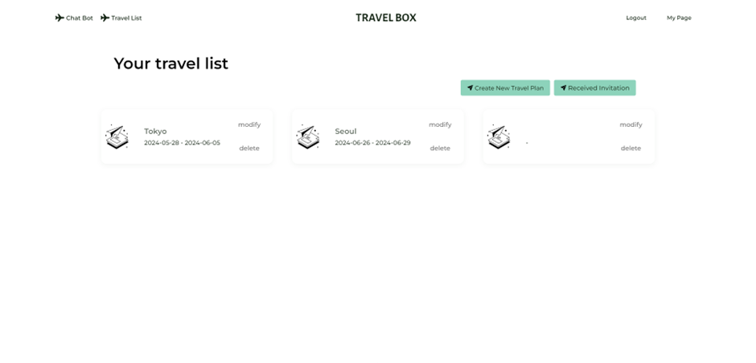

# TravelBox - 여행 계획 공유 서비스

> 2024.05.16 ~ 2024.05.24

## 📌 Introduction

1. [**서비스 소개**](#-서비스-소개)
2. [**기술 스택**](#-기술-스택)
3. [**서비스 화면**](#-서비스-화면)
4. [**팀원 소개**](#-팀원-소개)
5. [**문서**](#-문서)

## ✨ 서비스 소개

> **기획 의도**
>
> 여행 시 여권 정보, 숙박 정보, 일정 등 여행 정보를 효율적으로 기록, 관리, 공유하는 데 어려움이 많았습니다.  
> 이를 해결하기 위해 여행 정보를 쉽게 기록하고 공유할 수 있는 서비스를 기획하였습니다.

 

> **주요 기능**
>
> -   여권 정보, 숙박 정보, 여행 일정 등을 한 곳에서 관리하고 공유할 수 있습니다.
> -   동행자를 초대하여 실시간으로 여행 정보를 공유하고 채팅을 나눌 수 있습니다.

## 🔨 기술 스택

## 서비스 화면

홈 화면  

로그인 화면  

여행 리스트 화면  

여행 생성 화면  

여행 정보 화면  

여권 정보 등록 화면  

여행 일정 등록 화면  

동행자 초대 화면  

초대 알림 화면  

## 👨🏻‍💻 팀원 소개

|  |                                              |
| :----------------------------------------------------------------------------------------: | :------------------------------------------: |
|           [김예훈](https://github.com/gnsdp99) `Leader / Frontend / Backend`           | [이민지]() `Frontend / Backend / Design` |

## 📝 문서

### ERD

